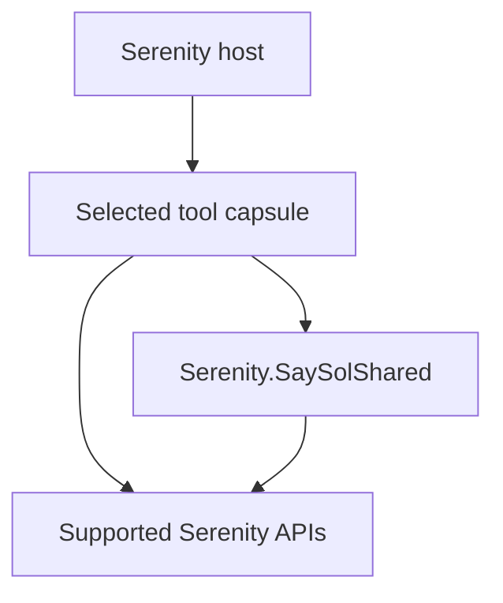

# Serenity tool-capsule architecture

Status: accepted architecture baseline

## Objective

Each tool must be independently understandable, testable, and installable. A
consumer should be able to copy or package one capsule without inheriting every
other SerenityTools feature.

Shared infrastructure lives under `src/Serenity.SaySolShared`. Tool
implementations live under `src/Tools/<ToolName>`. A tool may depend on Shared;
Shared must never depend on a tool or contain tool-specific business behavior.

```text
src/
├── Serenity.SaySolShared/
│   ├── dotnet/
│   └── ts/
└── Tools/
    └── <ToolCapsule>/
        ├── dotnet/
        ├── ts/
        └── README.md
```

Tests and samples mirror this structure under `tests/` and `samples/`.

## Dependency direction



No tool-to-tool dependency is allowed by default. If one tool requires another,
the relationship must be explicit, optional where practical, and documented in
both capsule manifests.

## What belongs in Serenity.SaySolShared

Shared is for stable infrastructure with at least two real capsule consumers or
for a repository-wide contract required from the start.

Approved shared categories:

- compatibility-lane abstractions and Serenity version adapters;
- stable SaySol type naming and registration helpers;
- localized text-key conventions;
- standard operation result, warning, validation, and error contracts;
- permission and current-user access abstractions without feature policy;
- temporary-operation token contracts when used by multiple upload/import tools;
- common test-host fixtures and installation verification helpers;
- disposable lifecycle helpers that are genuinely identical across capsules.

Shared must not contain:

- entity-specific rows, forms, columns, migrations, permissions, or lookups;
- Excel mapping rules, notification templates, audit policy, or other tool logic;
- a dependency used by only one capsule merely because it might be useful later;
- wrappers that reproduce an existing stable Serenity API without reducing a
  demonstrated compatibility problem;
- optional third-party libraries needed by only one tool.

## Shared-promotion rule

New code starts inside the capsule that needs it. Promote it to Shared only when:

1. at least two capsules use the same behavior;
2. the public contract can be named without referring to either capsule;
3. moving it does not force unrelated dependencies on consumers;
4. its version compatibility can be tested independently; and
5. the promotion reduces duplication rather than hiding coupling.

This prevents `Serenity.SaySolShared` from becoming a miscellaneous utility
dump that every capsule must drag into a project.

## Merge rule for overlapping wiki ideas

Wiki items are merged into one capsule when they implement the same user goal,
operate on the same Serenity extension point, and would otherwise expose
competing or duplicative APIs.

They remain separate capsules when they can be installed independently, carry
different security or data-integrity risks, or have distinct lifecycle and
dependency requirements. Shared plumbing may still be extracted after reuse is
proven.

## Capsule contract

Every capsule must contain a `README.md` describing:

- purpose and non-goals;
- source wiki IDs and consolidation decisions;
- supported Serenity lanes and evidence level;
- Shared dependencies and third-party dependencies;
- installation and configuration;
- permissions and security behavior;
- public .NET and TypeScript APIs;
- validation and test coverage;
- upgrade and uninstall procedure.

An optional machine-readable `capsule.yaml` will be added when the first capsule
API is stabilized. It will support future Toolbelt and Relay installation flows.
